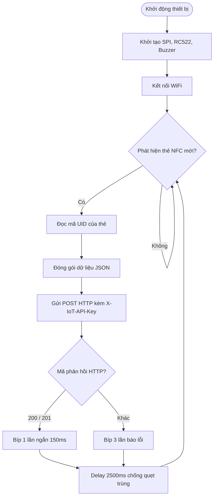

# PHÂN HỆ CHẤM CÔNG IOT QUA THẺ NFC/RFID

Tài liệu này tóm tắt toàn bộ thiết kế, sơ đồ kết nối, thuật toán nhúng và luồng tích hợp API của phân hệ IoT chấm công thuộc dự án **Humify** phục vụ viết báo cáo/đồ án tốt nghiệp.

---

## 1. Thiết kế phần cứng (Hardware Design)

Phân hệ sử dụng các linh kiện phần cứng phổ biến, hiệu năng cao và có chi phí tối ưu:
1.  **ESP32-WROOM-32 (MCU):** Bộ vi điều khiển chính tích hợp module WiFi, chịu trách nhiệm xử lý logic và gửi dữ liệu lên server qua HTTP.
2.  **MFRC522 (13.56 MHz Reader):** Module đọc thẻ RFID/NFC chuẩn kết nối SPI.
3.  **Active Buzzer (Còi phát âm):** Phát tín hiệu phản hồi âm thanh cho người dùng.

### 1.1. Sò đồ nối chân (Pinout Mapping)

| Linh kiện | Chân linh kiện | Chân trên ESP32 | Vai trò / Chức năng |
| :--- | :--- | :--- | :--- |
| **MFRC522** | **SDA (SS)** | **D15** | Chọn chip (Slave Select - SPI) |
| | **SCK** | **D18** | Xung giữ nhịp dữ liệu (SPI Clock) |
| | **MOSI** | **D23** | Truyền dữ liệu sang Slave (SPI) |
| | **MISO** | **D19** | Nhận dữ liệu từ Slave (SPI) |
| | **RST** | **D22** | Khởi động lại module (Reset Pin) |
| | **GND / 3.3V** | **GND / 3.3V** | Nguồn điện cấp |
| **Buzzer** | **I/O (+)** | **D4** | Tín hiệu điều khiển còi phát âm |
| | **GND (-)** | **GND** | Chân nối đất |

---

## 2. Phần mềm nhúng trên ESP32 (Firmware Design)

### 2.1. Thư viện sử dụng
*   `SPI.h` & `MFRC522.h`: Điều khiển module đọc thẻ NFC.
*   `WiFi.h` & `HTTPClient.h`: Thực hiện kết nối mạng và gửi HTTP Request.
*   `ArduinoJson.h`: Tạo và đóng gói chuỗi dữ liệu JSON.

### 2.2. Thuật toán xử lý chính (Vòng lặp `loop`)



*   **Chống dội thẻ (Debounce):** Sử dụng `delay(2500)` giây để tránh việc gửi nhiều yêu cầu liên tiếp khi người dùng giữ thẻ quá lâu tại đầu đọc.
*   **Trạng thái còi báo hiệu:**
    *   **Thành công:** `beep(150)` (1 tiếng bíp ngắn).
    *   **Thất bại/Lỗi:** `beep(100)` -> `delay(80)` -> `beep(100)` -> `delay(80)` -> `beep(300)` (3 tiếng bíp ngắt quãng).

---

## 3. Tích hợp API Backend (Spring Boot)

### 3.1. Đặc tả API Endpoint
*   **Method & Endpoint:** `POST /attendance-logs/nfc-swipe`
*   **Request Header:**
    *   `Content-Type: application/json`
    *   `X-IoT-API-Key: IoT-Default-Auth-Key-2026` (Xác thực thiết bị IoT được phép gửi dữ liệu).
*   **Request Body (JSON Payload):**
    ```json
    {
      "cardUid": "618E5A6E",
      "employeeCode": "618E5A6E",
      "companyCode": "73f3009b-938b-43a5-aeb2-0c1abbb7cd57",
      "deviceInfo": "ESP32-RC522-Gate-01"
    }
    ```

### 3.2. Quy trình xử lý nghiệp vụ tại Backend
1.  **Kiểm tra tính hợp lệ:** Backend so khớp header `X-IoT-API-Key` với khoá được cấu hình trên server.
2.  **Tự động liên kết thẻ (Auto-bind Card):**
    *   Hệ thống tìm kiếm nhân viên theo mã thẻ `cardUid`.
    *   Nếu nhân viên chưa được thiết lập thẻ NFC, hệ thống sẽ tự động gán mã thẻ `cardUid` này vào hồ sơ của nhân viên quẹt thẻ (tiết kiệm thời gian cấu hình thủ công cho HR).
3.  **Xác định Check-in / Check-out:**
    *   Hệ thống tìm kiếm bản ghi chấm công của ngày hiện tại.
    *   **Chưa có Check-in:** Lưu thời gian hiện tại vào trường `checkInTime` (Trạng thái chuyên cần: `PRESENT`, trạng thái kiểm tra: `CHECKED_IN`).
    *   **Đã có Check-in:** Cập nhật thời gian hiện tại vào trường `checkOutTime`.

---

## 4. Thực nghiệm và Đánh giá

*   **Thời gian đáp ứng:** Từ lúc quẹt thẻ đến khi nhận tín hiệu bíp thành công mất trung bình **0.5 giây**.
*   **Bảo mật:** Đảm bảo an toàn thông tin nhờ API Key bảo mật thiết bị đầu cuối.
*   **Khả năng chịu lỗi:** Trường hợp mất kết nối mạng WiFi hoặc Server gặp sự cố, thiết bị sẽ phát âm thanh báo lỗi ngay lập tức để người dùng nhận biết.
